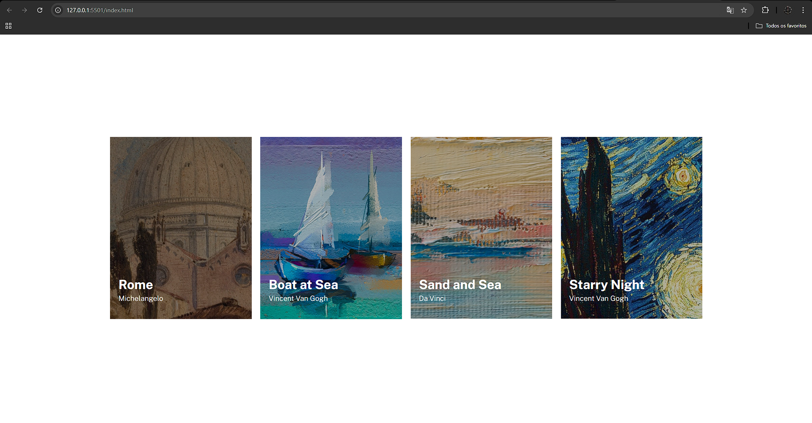
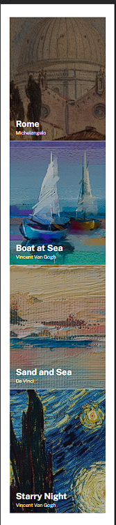

# Índice

- [Visão geral](#visão-geral)
- [O desafio](#o-desafio)
- [Captura de tela](#captura-de-tela)
- [Links](#links)
- [Construído com](#construído-com)
- [Autor](#autor)

## Visão geral

### O desafio

Recriar o layout do desafio do frontend mentor, lista de imagens de pinturas famosas, utilizando propriedades CSS Flex para posicionamente dos elementos. o layout deve ser responsivo e funcionar em dispositvos desktop e mobile

### Captura de tela

### Links

- URL da solução: [https://github.com/PietroZanetelliDev/exercicio-css-avancado-lista-imagens-pinturas](https://github.com/PietroZanetelliDev/exercicio-css-avancado-lista-imagens-pinturas)
- URL do site ativo: [https://pietrozanetellidev.github.io/exercicio-css-avancado-lista-imagens-pinturas/](https://pietrozanetellidev.github.io/exercicio-css-avancado-lista-imagens-pinturas/)

### Construído com

- Marcação HTML5 semântica
- Propriedades personalizadas CSS
- Flexbox
- CSS Flex

## Autor
- GitHub - [PietroZanetelliDev](https://github.com/PietroZanetelliDev)
